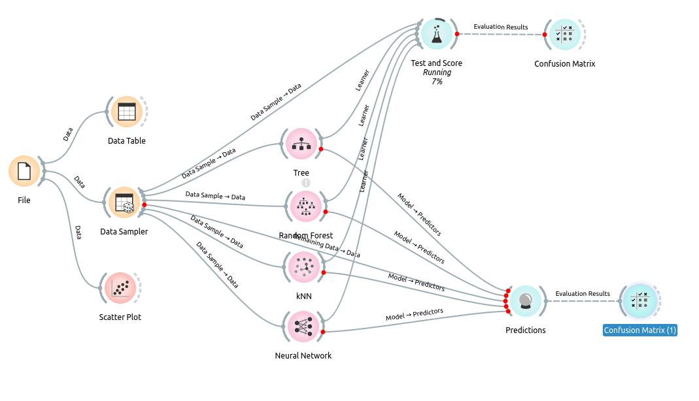

# Example solved using no-code technology (Orange 3)

## Requirements

- install Orange version 3.

## Installation

* Follow instructions at [download and install Orange](https://orangedatamining.com/download).

## Use

1. Run Orange.
2. Click File > Open > example.ows

## Complementary material

- [1] [getting-started with Orange](https://orangedatamining.com/getting-started/)
- [2] [Video tutorials](https://www.youtube.com/watch?v=HXjnDIgGDuI&list=PLmNPvQr9Tf-ZSDLwOzxpvY-HrE0yv-8Fy&index=2)
- [3] [Documentation](https://orangedatamining.com/widget-catalog/)

----

Please direct bug reports and pull requests to the GitHub page. To contact me directly, send email to tamagusko@gmail.com.

-- Tiago

[Copyright](LICENSE) (c) 2021, [Tiago Tamagusko](https://github.com/tamagusko).
